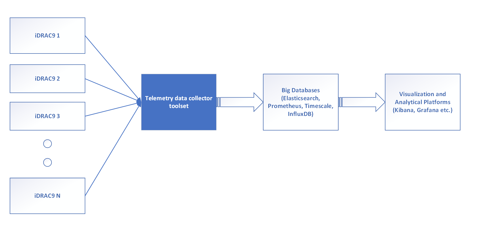
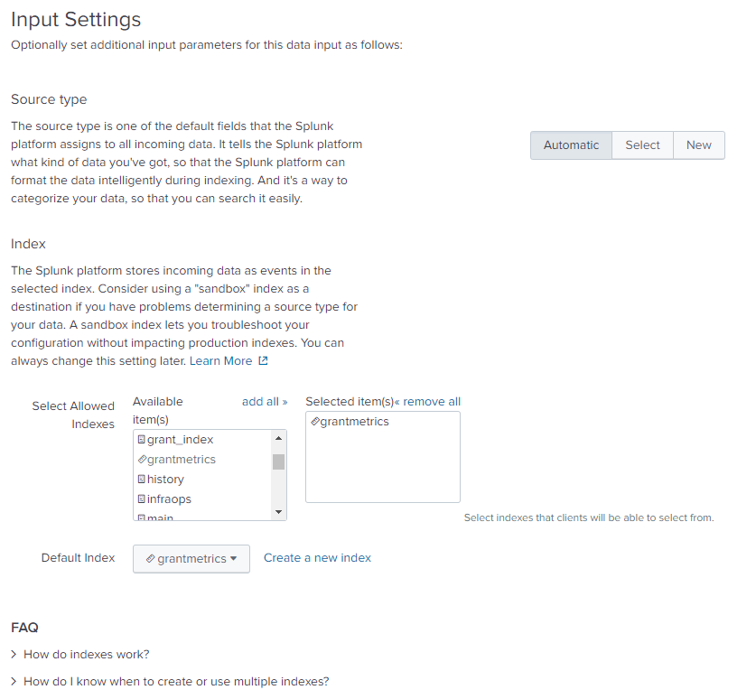

# Telemetry Reference Tools

- [Telemetry Reference Tools](#telemetry-reference-tools)
  - [Enabling Telemetry](#enabling-telemetry)
  - [Telemetry Report Types](#telemetry-report-types)
  - [Prerequisites](#prerequisites)
  - [Hardware and System Requirements](#hardware-and-system-requirements)
  - [Setup Instructions](#setup-instructions)
    - [Splunk](#splunk)
      - [Installing Splunk](#installing-splunk)
      - [Configure Metrics Index](#configure-metrics-index)
      - [Configure HTTP Event Collector](#configure-http-event-collector)
    - [Elasticsearch](#elasticsearch)
    - [Do for All Pipelines](#do-for-all-pipelines)
      - [Deploy Telemetry Pipeline with Docker Compose](#deploy-telemetry-pipeline-with-docker-compose)
  - [Debugging](#debugging)
  - [Default Ports Used](#default-ports-used)
  - [Understanding Internal Workflow](#understanding-internal-workflow)
  - [Understanding the API](#understanding-the-api)
  - [LICENSE](#license)
  - [Contributing](#contributing)
  - [Disclaimer](#disclaimer)
  - [Support](#support)


PowerEdge Telemetry reference toolset collects the metric reports from various devices at the PowerEdge compute and outlines a reference design to integrate with external big databases for downstream analytics and visualization.



PowerEdge servers with iDRAC9 version 4.00 or higher and Datacenter license can stream server telemetry data out for downstream analytics and consumption. iDRAC telemetry data simply put is a timestamped metrics that represent various datapoints about the server components and is streamed out in a format defined by the DMTF Telemetry Redfish standard. This datapoints includes information from various sensors, storage and networking subsystem and helps IT administrators better understand health and necessary details about their server infrastructure.

## Enabling Telemetry

For details on enabling telemetry and configuring reports see the [iDRAC-Telemetry-Scripting](https://github.com/dell/iDRAC-Telemetry-Scripting) API.

## Telemetry Report Types

There are currently 24 report types available. You can obtain a list by browsing to your iDRAC at `https://<iDRAC>/redfish/v1/TelemetryService/MetricReports`:

- StorageDiskSMARTData
- SerialLog
- ThermalMetrics
- MemorySensor
- GPUMetrics
- ThermalSensor
- CPURegisters
- AggregationMetrics
- GPUStatistics
- Sensor
- NICSensor
- FanSensor
- PowerMetrics
- NICStatistics
- StorageSensor
- CPUMemMetrics
- PowerStatistics
- FPGASensor
- CPUSensor
- PSUMetrics
- FCPortStatistics
- NVMeSMARTData
- FCSensor
- SystemUsage

## Prerequisites
* Go - https://golang.org/
* ActiveMQ (Message broker framework)

## Hardware and System Requirements
The toolset has been tested on PowerEdge R640 with Ubuntu 20.04.1 operating system. 

CPU - Intel(R) Xeon(R) Gold 6130 CPU @ 2.10GHz
RAM - 16GB

## Setup Instructions  

Please reference the included Docker Compose files for setup instructions.

### Splunk

#### Installing Splunk

**NOTE**: Splunk server tested on RHEL 8.3
**NOTE** The Splunk configuration is under active development. Currently, we are not using a Splunk container and 
are running Splunk from a manual installation detailed below

1. Download [trial of Splunk](https://www.splunk.com/en_us/download/splunk-enterprise.html?skip_request_page=1)
2. Follow [Splunk installation instructions](https://docs.splunk.com/Documentation/Splunk/8.2.4/Installation/InstallonLinux)
3. By default it will install to /opt/splunk. Run `/opt/splunk/bin/splunk start` (I suggest you do this in tmux or another terminal emulator)
4. Run the following command: `vim /opt/splunk/etc/apps/splunk_httpinput/default/inputs.conf` and make sure your config looks like this:

    ```
    [http]
    disabled=0
    port=8088
    enableSSL=0
    dedicatedIoThreads=2
    maxThreads = 0
    maxSockets = 0
    useDeploymentServer=0
    # ssl settings are similar to mgmt server
    sslVersions=*,-ssl2
    allowSslCompression=true
    allowSslRenegotiation=true
    ackIdleCleanup=true
    ```

5. Run `firewall-cmd --permanent --zone public --add-port={8000/tcp,8088/tcp} && firewall-cmd --reload`
6. Make splunk start on boot with `/opt/splunk/bin/splunk enable boot-start`

#### Configure Metrics Index

1. Browse to your Splunk management dashboard at `<IP>:8000`.
2. Go to Settings -> Indexes


3. In the top right of the screen click "New Index"
4. Create a name, set Index Data Type to Metrics, and Timestamp Resolution to Seconds


#### Configure HTTP Event Collector

1. Browse to your Splunk management dashboard at `<IP>:8000`.
2. Go to Settings -> Data Inputs


3. On the following screen click "Add new" next to HTTP Event Collector


4. Select any name you like for the collector and click "Next" at the top of the screen
5. Select "Automatic" for Source type and for Index select the metrics index you created previously



6. Click Review at the top, make sure everything is correct and then click "Submit" (again at the top)

At this juncture, you have done everything you need to on the Splunk side to get everything up and running. Next you need
to finish configuring the docker pipeline. Proceed to [Do for All Pipelines](#do-for-all-pipelines)

### Elasticsearch

For Elasticsearch, there are some external settings you must configure first. The below instructions are written for
Linux and were tested on Ubuntu 20.04.3 LTS. 

1. Set vm.max_map_count to at least 262144
   1. `grep vm.max_map_count /etc/sysctl.conf`. If you do not see `vm.max_map_count=262144` edit the file and add 
      that line.
   2. You can apply the setting to a live system with `sysctl -w vm.max_map_count=262144`
2. Depending on whether this is a lab or production there are several other settings which should be configured to 
   tune ES' performance according to your system. See: https://www.elastic.co/guide/en/elasticsearch/reference/current/docker.html

Next you need to finish configuring the docker pipeline. Proceed to [Do for All Pipelines](#do-for-all-pipelines)

### Do for All Pipelines

These instructions apply to all pipelines

#### Deploy Telemetry Pipeline with Docker Compose

This is done on whatever host you would like to use to connect to all of your iDRACs

1. git clone https://github.com/dell/iDRAC-Telemetry-Reference-Tools
2. (For Splunk) Edit `iDRAC-Telemetry-Reference-Tools/docker-compose-files/splunk-docker-pipeline-reference-unenc.yml` 
   with your favorite text editor. Change the environment variables SPLUNK_URL and SPLUNK_KEY for splunkpump to 
   match the token generated for your http event listener and update the URL to match your external Splunk instance
3. `sudo docker-compose -f ./iDRAC-Telemetry-Reference-Tools/docker-compose-files/splunk-docker-pipeline-reference-unenc.yml up -d`

## Debugging

See [DEBUGGING.md](./DEBUGGING.md)

## Default Ports Used

- 3000 - Grafana
- 8082 - configgui port
- 8088 - Splunk HTTP Event Listener (if using Splunk)
- 8000 - Splunk Management UI (if using Splunk)
- 8161 - ActiveMQ Administrative Interface (default credentials are admin/admin)
- 61613 - ActiveMQ messaging port. Redfish read will send to this port

## Understanding Internal Workflow

1. Users begins by running the appropriate docker compose file. This will start a number of containers detailed below
2. Runs the container telemetry-receiver. This is going to set up all the services required to get the data from
   iDRAC and into the messaging queue. This begins with idrac-telemetry-receiver.sh which runs the following go files:
   1. dbdiscauth.go - Runs a mysql DB where users can control the pipeline's configuration variables
   2. configui.go - Runs a lightweight GUI on port 8082 (by default) which allows you to change the configuration
     parameters of the system. It will store these settings in mysql
   3. redfishread.go - Sets up an SSE event listener which receives events from the iDRAC and also creates the
     queue in ActiveMQ. The topic name is databus. This is defined in databus.go by the constant `CommandQueue`
   4. (optional) simpleauth.go/simpledisc.go - Allows the user to input config variables through the config.ini file
3. Runs mysqldb container. mysql provides a mechanism for persisting user settings via a named volume mount
4. Runs activemq container - redfishread will pass events from itself to activemq
5. Runs desired database container (elastic/influxdb/prometheus)
6. Runs the required pump (elkpump/splunkpump/etc)
7. All networking between the various containers is accomplished with a docker backend network

Note: There are two ways which a user can provide configuration data. These are controlled in redfishread.go
1. ConfigUI which provides a simple user interface for controlling config variables. ConfigUI will push configuration data into mysql
   1. Note: You could directly push data to mysql instead
2. simpledisc/simpleauth have file based source identification through the file config.ini

## Understanding the API

To understand a bit more about interacting with the various API endpoints it may be helpful to look at the [GetSensorThresholds README](scripts/GetSensorThresholds/README.md)

A tutorial on YouTube is available [here](https://www.youtube.com/watch?v=T5ve03DB77I)

## LICENSE
This project is licensed under Apache 2.0 License. See the [LICENSE](LICENSE.md) for more information.

## Contributing
We welcome your contributions to this reference toolset. See [Contributing Guidelines](CONTRIBUTING.md) for more details.
Please reference our [Code of Conduct](CODE_OF_CONDUCT.md).

## Disclaimer
The software applications included in this package are  considered "BETA". They are intended for testing use in non-production  environments only. 

No support is implied or offered. Dell Corporation assumes no  responsibility for results or performance of "BETA" files.  Dell does NOT warrant that the Software will meet your requirements, or that operation of the Software will be uninterrupted or error free. The Software is provided to you "AS IS" without warranty of any kind. DELL DISCLAIMS ALL WARRANTIES, EXPRESS OR IMPLIED, INCLUDING, WITHOUT LIMITATION, THE IMPLIED WARRANTIES OF MERCHANTABILITY, FITNESS FOR A PARTICULAR PURPOSE, TITLE AND NON-INFRINGEMENT. The entire risk as to the results and performance of the Software is assumed by you. No technical support provided with this Software. 

IN NO EVENT SHALL DELL OR ITS SUPPLIERS BE LIABLE FOR ANY DIRECT OR INDIRECT DAMAGES WHATSOEVER (INCLUDING, WITHOUT LIMITATION, DAMAGES FOR LOSS OF BUSINESS PROFITS, BUSINESS INTERRUPTION, LOSS OF BUSINESS INFORMATION, OR OTHER PECUNIARY LOSS) ARISING OUT OF USE OR INABILITY TO USE THE SOFTWARE, EVEN IF ADVISED OF THE POSSIBILITY OF SUCH DAMAGES. Some jurisdictions do not allow an exclusion or limitation of liability for consequential or incidental damages, so the above limitation may not apply to you.


## Support
- To report an issue open one [here](https://github.com/dell/iDRAC-Telemetry-Reference-Tools/issues).
- If any requirements have not been addressed, then create an issue [here](https://github.com/dell/iDRAC-Telemetry-Reference-Tools/issues).
- To provide feedback to the development team, email **idractelemetryteam@dell.com**.
